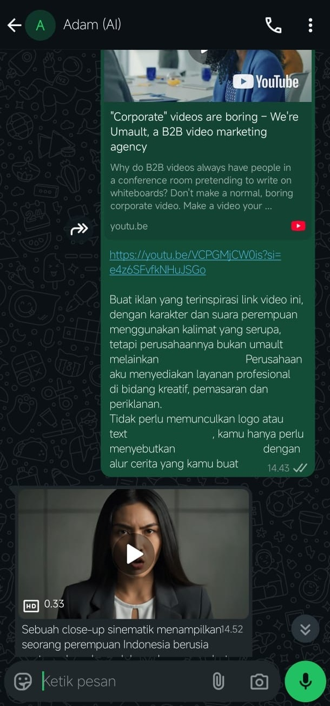

# 📖 ADAM Documentation

Welcome to the detailed documentation of **ADAM (Automated Data Analysis and Media)**.  
This document provides an in-depth explanation of **features, architecture, tech stack, and roadmap** for the project.

---

## 🚀 Features

ADAM brings together **workflow automation, data intelligence, and media generation** in one ecosystem:

1. **Data Analysis**  
   - Supports text, audio, images, video, and documents.  
   - Extract structured insights from unstructured data.  

2. **Knowledge Retrieval**  
   - Query from **Google Sheets** or **Supabase (Postgres)** in natural language.  
   - Convert Natural Language Query (NLQ) into SQL automatically.  

3. **Workflow Automation**  
   - From **WhatsApp → analysis → response → data entry** runs seamlessly.  
   - Automates routine business processes with minimal manual input.  

4. **Media Generation**  
   - **Video**: Using **Vertex AI + Google VEO 3** with **JSON-based prompts** (ensures character, voice, and style consistency → production-ready).  
   - **Image**: Generate visuals instantly from text or captions.  
   - **Voice**: Integrated with **ElevenLabs TTS + Voice Changer** for audio output.  

5. **Business Intelligence**  
   - Generate **Financial Reports** from invoices and purchase orders.  
   - Provide **Recommendations** for product prioritization, profit maximization, or marketing strategies.  
   - Perform **Summarization** on long documents, videos, or audio into concise insights.  

---

## 🏗 Architecture
```
WhatsApp → n8n Workflow → (AI + Data Services) → Response / Media Output
```

**Main Components:**
- **Frontend Channel**: WhatsApp Business API  
- **Workflow Orchestrator**: n8n (hosted on AWS EC2 + Ngrok)  
- **AI Models**:  
  - Google Gemini (text, image, multimodal)  
  - Vertex AI + Google VEO 3 (video generation)  
  - ElevenLabs (voice TTS + voice changer)  
- **Databases**:  
  - Google Sheets (lightweight data)  
  - Supabase (Postgres DB for structured storage)  

---

## 🛠 Tech Stack

- **Workflow Engine**: n8n (automation & orchestration)  
- **Cloud Hosting**: AWS EC2 + Ngrok tunnel  
- **AI & Media Models**:  
  - Google Gemini (NLU & multimodal analysis)  
  - Vertex AI + VEO 3 (video generation with JSON prompts)  
  - ElevenLabs (voice synthesis & transformation)  
- **Databases**: Supabase (Postgres), Google Sheets  
- **Messaging**: WhatsApp Business API  

---

## 📈 Roadmap

✅ Implemented:  
- Data analysis for text/audio/images/video  
- Natural Language Query (NLQ) → SQL  
- Recommendations & Summarization  
- Media generation (video, image, audio/voice)  
- Supabase integration  
- End-to-end automation via WhatsApp  

🔜 Next Steps:  
- **Predictive Insights**: Forecast trends & business performance.  
- **Data Visualization**: Deliver insights in interactive charts & dashboards. 
- **Multi-channel Support**: Extend to Telegram, Slack and more. 

---

## 📷 Demo Screenshots

<p align="center">
  
  
  
</p>

---

## 🔗 Author

✨ Created by **Farras Azhary**  
- 📍 GitHub: [github.com/farrazhary](https://github.com/farrazhary)  
- 🔗 LinkedIn: [linkedin.com/in/farrasazhary](https://linkedin.com/in/farrasazhary)